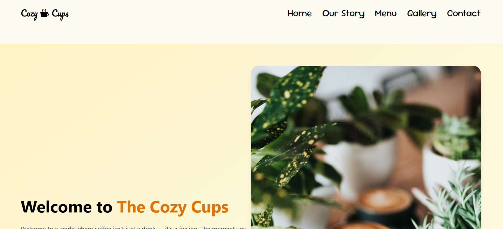
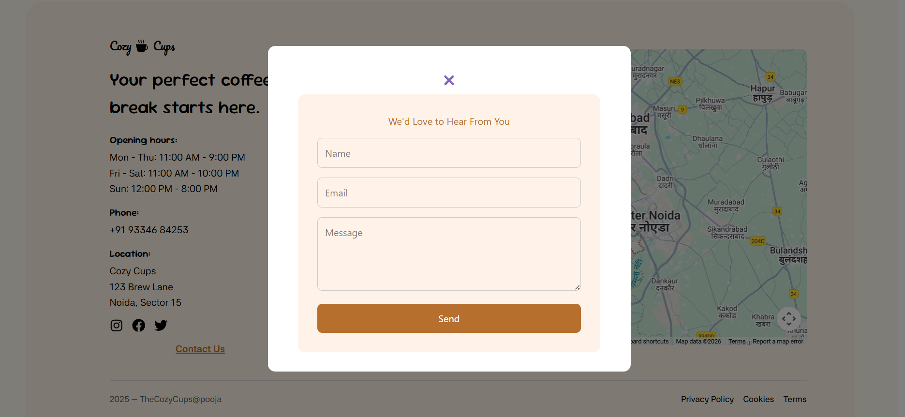
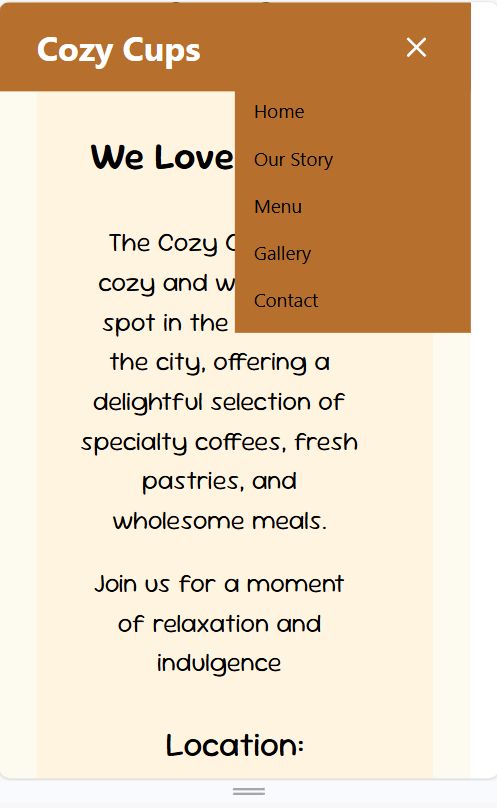

# ☕ Cozy Cups - Online Coffee Shop

A modern and fully responsive **React-based Coffee Shop website** showcasing a variety of coffee products with smooth UI/UX and interactive features. The project is designed for both **desktop and mobile devices**.  

---

## 🌐 Live Demo
You can check the live website here:  
[**Cozy Cups Live Site**](https://helpful-cajeta-824046.netlify.app/)

---

## 📸 Screenshots

### 💻 Home Page

### 📞 Contact Page

### 📱 Mobile View

---

## ⚡ Features

- ✅ Fully responsive design (Desktop & Mobile)
- ✅ Smooth menu carousel using **Swiper.js**
- ✅ Dynamic **daily coffee specials** showcase
- ✅ Interactive buttons and hover animations
- ✅ Mobile-first input search and interactive navbar
- ✅ Deployment ready (Netlify)

---

## 🛠️ Tech Stack

- **Frontend:** React.js  
- **Styling:** CSS3 + Tailwind (optional)  
- **Animation / Carousel:** Swiper.js, GSAP  
- **Deployment:** Netlify
  
---

## 👩‍💻 Author

Pooja Kumari
Computer Science Graduate(B.Tech)
Interested in Web Development & JavaScript-based Projects
